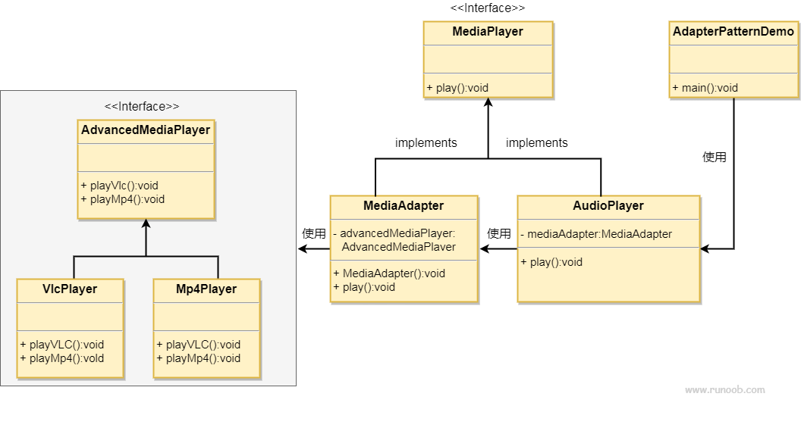

### 适配器模式

1. 主要解决在环境中，需要将现有的对象放入新环境，然而新环境的接口并不能满足现有对象
2. 在工厂的基础上，产品有在类型之上还有多个分类
3. 优点：
      1) 可以让任何两个没有关联的类一起运行
      2) 提高类的复用性
      3) 增加类的透明度
      4) 灵活性好
4. 缺点：
      1) 过多使用适配器会使得系统非常乱
5. 使用场景：
      1) 需要产品去兼容不同的使用场景，或者兼容新老版本
###  需注意的是，适配器模式是不是在项目设计时加的，而是解决正在使用时的项目问题