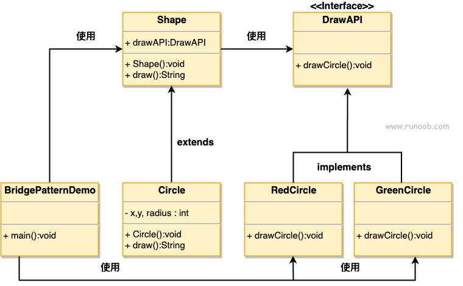

### 桥接模式

1. 主要解决在有多种变化可能的情况下，继承会导致类爆炸、不好扩展的问题
2. 把变化的各个角度分离出来，较少耦合
3. 优点：
      1) 抽象和是先分离
      2) 扩展能力优秀
      3) 实现细节对客户透明
4. 缺点：
      1) 会增加系统的理解与设计难度。因为聚合关系在抽象层，用户需要对抽象层进行设计与开发
5. 使用场景：
      1) 需要抽象和具体实现之间增加更多的灵活性，避免在两个层次间建立静态的继承关系，可以通过桥接模式来建立它们之间的关系
      2) 适用于不希望使用继承或者避免多层次继承导致系统类个数爆炸的情况
      3) 一个类存在多个独立变化的维度，需要桥接模式对各个维度进行单独扩展
###  当有两个独立变化的维度时，使用桥接模式就很合适了