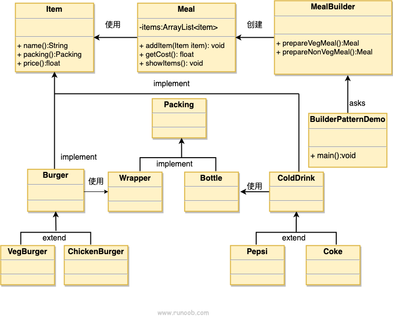

### 建造者模式

1. 在实际使用中，会有需要构建复杂对象的情况，且对象各个组成部分由复杂的算法组成，
随着业务逻辑的变化，复杂对象底下的各个组成部分也会发生改变，但是将它们组合在一起的
算法逻辑却相对稳定，此时就可以使用建造者模式了（关键是要分离出变与不变的部分）
2. 优点：
      1) 建造者独立，易扩展
      2) 因为细节都分到每个建造者上，所以容易控制风险
3. 缺点：
      1) 产品必须存在共性，才能去抽离出共同点
      2) 如果内部变化较为复杂，会导致产生大量的建造类
4. 使用场景：
      1) 对象内部结构较为复杂
      2) 对象内部结构之间存在关联关系
###  与工厂模式相比，建造者模式更注重内部"零件"的装配顺序