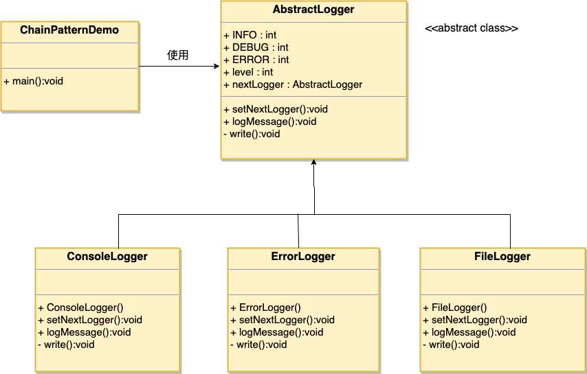

### 责任链模式

1. 用户只需要将请求发到责任链上，让责任链上的处理者处理请求，责任链将请求的发送者和处理者解耦了
3. 优点：
      1) 降低耦合度
      2) 简化对象，对象无需知道链的结构
      3) 给对象指派职责灵活，改变链内成员或者改变调用次序就可以动态新增或删除职责
4. 缺点：
      1) 不能保证请求一定被接收
      2) 会对系统性能造成一定影响，可能会有循环调用的情况
      3) 可能不容易观察运行时的特征，不方便排错
5. 使用场景：
      1) 多个对象可以处理一个请求，具体使用到哪个在运行时自动确定
      2) 在不明确接收者时，向多个对象中任意一个提交请求
      3) 可动态指定一组对象处理请求
###  Java Web中应用很多