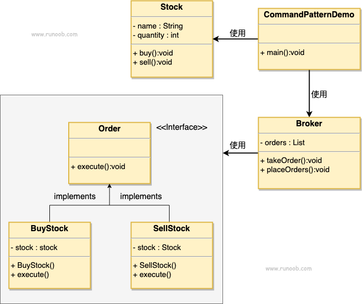

### 命令模式

1. 某些系统重，请求者和实现者是紧耦合关系，当执行需要对行为进行记录、操作撤销或重做、事务处理之类的操作时，紧耦合的结构就无法去应对这些变化了
2. 优点：
      1) 降低耦合度
      2) 新命令加到系统中很容易，较灵活
3. 缺点：
      1) 会导致系统中有大量的具体命令实现类
4. 使用场景：
      1) 可以被认为使用命令的场景都可以使用命令模式
###  系统需要支持命令的撤销（Redo）和恢复操作（Undo） 

#### 结构示意图
