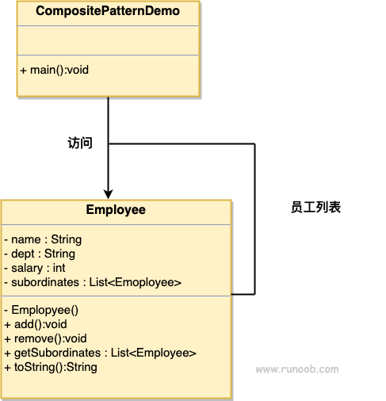

### 组合模式

1. 模糊了树形结构中简单元素和复杂元素的概念，通过"部分-整体"使得单个对象与组合对象具有一致性，像处理简单元素那样处理复杂元素，与复杂元素内部的复杂结构解耦
2. 希望表示树形结构或者希望单个对象与整体间的不同
3. 优点：
      1) 高层调用模块调用简单
      2) 节点自由增加
4. 缺点：
      1) 叶子节点与树枝都是实现类，而非接口，违反依赖倒置原则
5. 使用场景：
      1) 涉及到"部分-整体"的场景，如：组织机构之类的树形菜单、文件和文件夹的管理等
###  定义组合实现时为具体的实现类而非接口