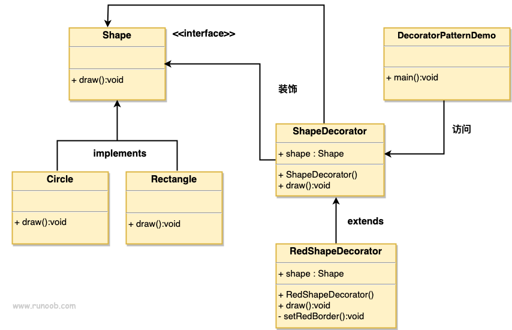

### 装饰器模式

1. 主要为了处理类由于继承引入了静态特征，当扩展功能越来越多时，子类会发生膨胀的问题
2. 在不想新增子类的情况下使用装饰者来扩展类
3. 优点：
      1) 装饰者和被装饰类可以相互独立，不会互相耦合，可作为继承的一种替代模式，可以动态扩展一个实现类的功能
4. 缺点：
      1) 当装饰的需求较多，多层装饰时会导致逻辑很复杂
5. 使用场景：
      1) 扩展一个类的功能
      2) 动态增加撤销类的功能
###  可替代继承