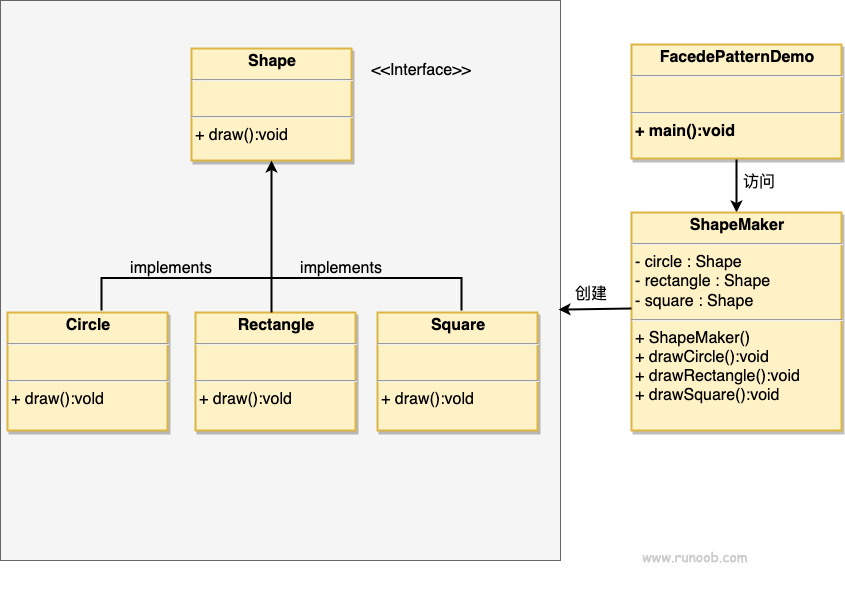

### 外观模式

1. 主要为了降低访问复杂系统内部子系统的复杂度
2. 作为系统的"入口"，用户不需要知道内部的复杂度
3. 优点：
      1) 减少系统间的相互依赖
      2) 提高灵活性
      3) 提高安全性（毕竟相当于一个黑盒，能接触的只有"门面"）
4. 缺点：
      1) 不符合开闭原则，不好去继承或者重写，不好去改东西
5. 使用场景：
      1) 为复杂的模块或子系统提供可供外界访问的"门面"
      2) 子系统相对独立
      3) 承接上一点，可以隔离各个子系统的风险（菜鸟上是说预防低水平人员带来的风险）
###  在层次化结构中，可用外观模式来定义每一层的入口