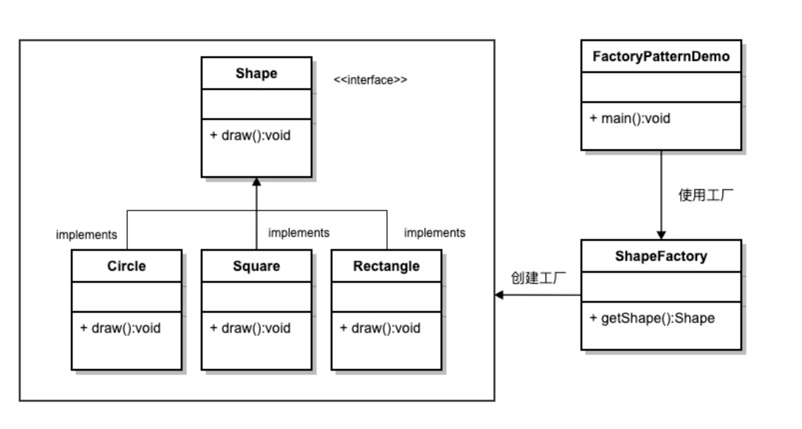

### 工厂模式

1. 主要解决接口选择问题
2. 需要根据不同类型创建实例时使用，将创建实例的工作交给子类
3. 优点：
      1) 只需要知道类型就可以创建一个对应实例
      2) 增加一个新的类型时只需要新增一个工厂即可
      3) 屏蔽具体实现，调用者只需要知道调用的接口即可
4. 缺点：
      1) 每增加一个类型都需要新增一个工厂，会提升整块代码的复杂度
5. 使用场景：
      1) 日志记录器：根据用户选择来创建不同地方日志的工厂「本地硬盘、远程系统」
      2) 连接数据库：应对数据库类型可能发生变化的情况
      3) 多个协议连接系统的框架，如邮件的POP3、IMAP协议等
###  需注意的是，简单对象就别用工厂了，一个new就能解决的事，没必要加上工厂徒增系统复杂度！！！