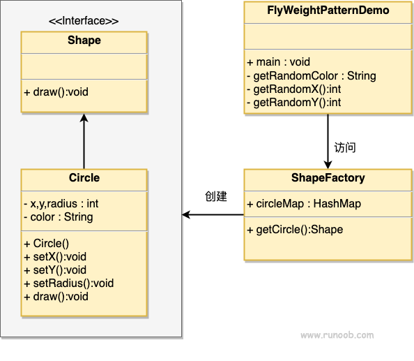
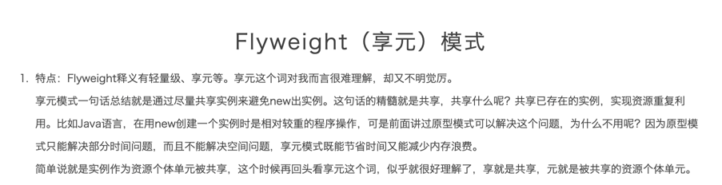

### 享元模式

1. 主要为了防止创建大量对象时内存溢出，所以享元模式把这些其中共同的部分抽出来，在有相同的请求时直接从内存拿，避免重复创建
2. 何时使用
   1. 系统中有大量对象
   2. 这些对象消耗大量内存
   3. 这些对象的状态大多可以外部化
   4. 可以根据对象内部状态去分组，去除外部状态后，每一组对象都可以用一个对象来代替
   5. 系统不依赖于这些对象身份，这些对象时不可分辨的（这是菜鸟教程的原话。。。有点难以理解）
3. 优点：
      1) 大大减少对象的创建，减少系统内存的占用，从而使得效率提高
4. 缺点：
      1) 提高了系统的复杂度，需要分理处对象的内部状态和外部状态，且外部状态不能随着内部状态的变化而变化
5. 使用场景：
      1) 系统存在大量对象的场景
      2) 需要缓冲池
###  1.注意划分外部状态和内部状态，否则可能会引起线程安全问题 
###  2.这些类必须有一个对象工厂加以控制 

#### 享元的解释（flyweight解释称享元，没看到下图的解释还真不理解）：
