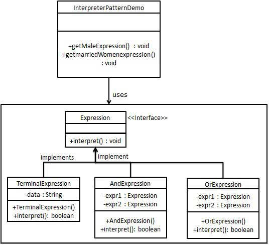

### 解释器模式

1. 可以针对一些固定的文法构建一个解释句子的解释器
2. 优点：
      1) 可扩展性比较好，灵活
      2) 增加了新的解释表达式的方式
      3) 易于实现简单文法
3. 缺点：
      1) 可利用场景比较少
      2) 对于复杂的文法比较难维护
      3) 解释器模式会引起类膨胀
      4) 解释器模式采用递归调用方法
4. 使用场景：
      1) 可以将一个需要解释执行的语言中的句子表示为一个抽象语法树
      2) 一些重复出现的问题可以用一种简单的语言来进行表达
      3) 一个简单语法需要解释的场景
###  可利用场景比较少，JAVA 中如果碰到可以用 expression4J 代替 