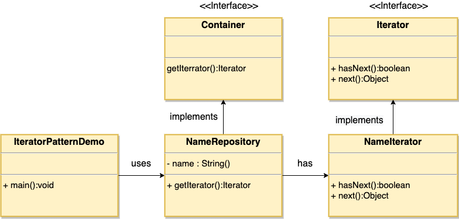

### 迭代器模式

1. 以不同的方式来遍历整个聚合对象
2. 优点：
      1) 支持以不同的方式遍历一个聚合对象
      2) 迭代器简化了聚合类
      3) 在同一个聚合上可以有多个遍历
      4) 在这个模式中增加新的聚合类和迭代器都很方便，不需要改动原有的代码
3. 缺点：
      1) 由于迭代器将存储数据和遍历数据的职责分离，所以每一个新的聚合类都需要拥有它自己的迭代器类，一定程度上会增加系统复杂性
4. 使用场景：
      1) 访问一个聚合对象的内容而无需暴露它的内部表示
      2) 需要为聚合对象提供多种遍历方式
      3) 为遍历不同的聚合结构提供一个统一接口
###  迭代器模式就是分离了集合对象的遍历行为，抽象出一个迭代器类来负责，既不暴露集合内部结构，又可以让外部代码透明地访问集合内部的数据 