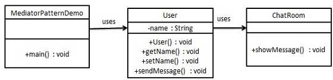

### 中介者模式

1. 主要解决对象之间存在大量的关联关系，这样势必会导致整个系统的结构变复杂，若一个对象改变，其关联的对象也应发生改变的情况，
将多个类相互关联的网状结构分离为星型结构
2. 优点：
      1) 降低了类的复杂度，将一对多转化成一对一
      2) 各个类之间解耦
      3) 符合迪米特法则「一个类对于其他类知道的越少越好」
3. 缺点：
      1) 中介者会越来越庞大，最终难以维护
4. 使用场景：
      1) 系统中对象之间存在比较复杂的引用关系，导致它们之间依赖关系结构混乱且难以复用
      2) 想通过一个中间类来封装多个类中的行为，同时又不想生成太多子类
###  不应当在职责混乱的时候使用 