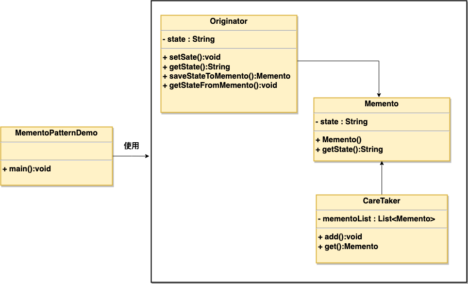

### 备忘录模式

1. 在不破坏封装的前提下，捕获一个对象的内部状态，并在该对象之外保存这个状态，这样可以在以后将对象回复到原先保存的状态
2. 优点：
      1) 给用户提供了一个可以恢复状态的机制，可以使用户能够比较方便地回到某个历史状态
      2) 实现了信息的封装，使得用户不需要关心状态的保存细节
3. 缺点：
      1) 消耗资源。如果类的成员变量过多，势必会占用较大的资源，而且每一次保存都会消耗一定内存
4. 使用场景：
      1) 需要保存/恢复数据的相关状态场景
      2) 提供一个可回滚的操作
###  1、为了符合迪米特法则，还需要增加一个管理备忘录的类；
### 2、为了节约内存，可使用原型模式+备忘录模式 