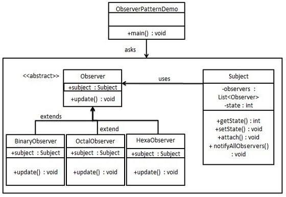

### 观察者模式（生产中一般用消息队列去实现了）

1. 目标对象状态发生改变，所有的依赖对象（观察者对象）都将得到通知（广播）
2. 优点：
      1) 观察者和被观察者是抽象耦合的
      2) 建立了一套触发机制，使得二者能够联动
3. 缺点：
      1) 如果一个被观察对象有很多的直接和间接观察者的话，通知到所有的观察者会耗费很多时间
      2) 如果观察者和被观察者之间有循环依赖的话，观察目标会触发它们之间进行循环调用，可能导致系统崩溃
      3) 观察者模式没有相应的机制让后观察者知道所观察的目标对象是怎么发生变化的，而是仅仅知道观察目标发生了变化
4. 使用场景：
      1) 需要保存/恢复数据的相关状态场景
      2) 提供一个可回滚的操作
###  1、Java中已经有了观察者模式的支持类「关于该支持类的使用可以查看下方链接」；
https://blog.csdn.net/u012250875/article/details/77747878
### 2、避免循环调用；
### 3、如果顺序执行，某一观察者可能会导致系统阻塞，一般采用异步的方式 
