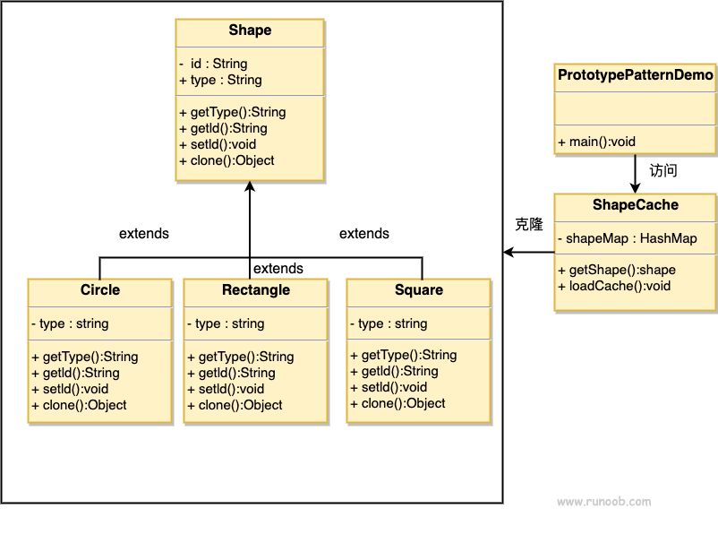

### 原型模式

1. 主要解决运行期间创建和删除原型的问题
2. 优点：
      1) 性能提高
      2) 避免收到构造函数的约束
3. 缺点：
      1) 当被克隆对象引用不支持串行化的间接对象或者引用含有循环结构会有问题
      2) 必须事先cloneable接口
4. 使用场景：
      1) 资源优化
      2) 类初始化需要消耗大量的资源
      3) 对于性能和安全性要求较高的场景
      4) 高并发的场景
      5) 一般和工厂模式配套出现，clone创建对象
###  与实例化一个类不同，原型模式是拷贝一个现有对象来生成新对象的，浅拷贝实现Cloneable，深拷贝实现Serializable读二进制流