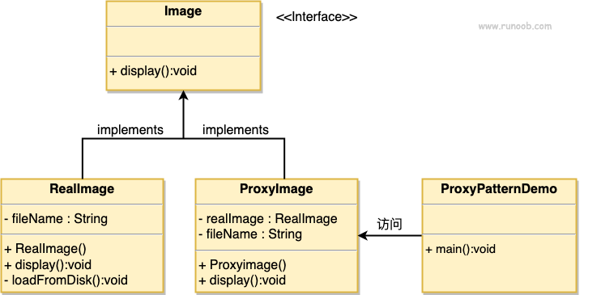

### 代理模式

1. 主要为了解决直接访问对象带来的问题，比如远程调用、针对对象的操作需要一些安全控制之类的，直接访问会带来很多问题的情况
2. 有需要在访问类之前先做一些处理可以使用此模式
3. 优点：
      1) 职责清晰
      2) 高扩展性
      3) 智能化
4. 缺点：
      1) 因为客户端和实际请求的对象之间加入了代理对象，某些代理模式可能会导致访问请求处理性能变慢
      2) 实现代理模式需要额外的工作，且有些代理模式实现起来非常复杂，开发过程更加麻烦
5. 使用场景（按职责划分）：
      1) 远程代理
      2) 虚拟代理
      3) Copy-on-Write代理
      4) 保护（Protect or Access）代理
      5) cache代理
      6) firewall代理
      7) synchronization代理
      8) 智能引用（Smart Reference）代理「智能引用也叫智能指引，取代了简单的指针，在访问对象时可以加一些附加操作，典型用途例例如：实际对象引用计数，没有引用时自动释放它，也叫Smart Points；」
###  1.注意和适配器模式区分，适配器模式主要用来改变针对对象的接口，而代理模式不改变被代理类接口 
###  2.和装饰器模式的区别，装饰器模式是为了增强功能，而代理模式是为了加以控制（其实日常开发用到动态代理也会去增强被代理类的功能） 
