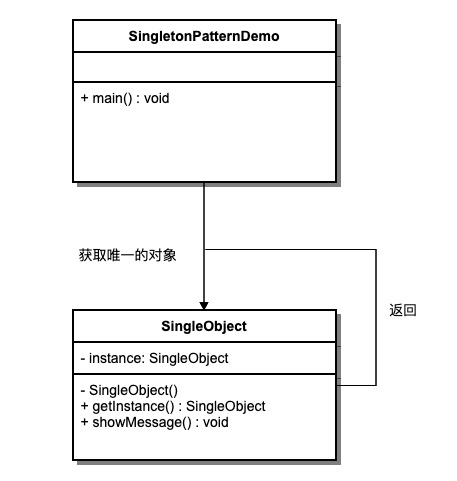

### 单例模式

1. 主要解决实例在全局中频繁点创建于销毁使用的资源过多的问题
2. 优点：
      1) 只有一个实例，可以减少内存开销
      2) 避免对于资源的多重占用（比如写文件）
3. 缺点：
      1) 与单一职责冲突，类应该只关心内部逻辑，不应该关心外部如何来实例化
4. 使用场景：
      1) 这个熟的很，没啥好记录的
###  要注意多线程并发的情况