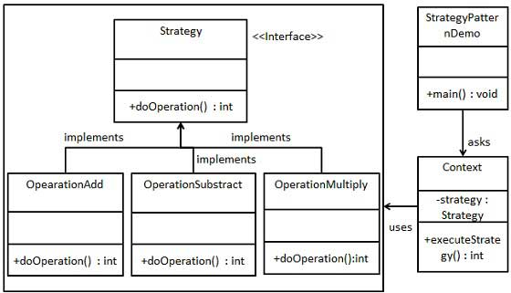

### 策略模式

1. 在多个算法相似的情况下，防止if...else过多导致代码过于复杂难以维护
2. 优点：
      1) 算法可以自由切换
      2) 避免使用多重条件判断
      3) 扩展性良好
3. 缺点：
      1) 策略类会随着策略的增多而不断增多
      2) 所有策略类都要对外暴露
4. 使用场景：
      1) 系统中存在许多仅在行为上不同的类，这是可以用策略模式动态地让一个对象在多种行为之间选择
      2) 系统中存在多种算法，且需要动态地选择其中的一种
      3) 一个对象有很多种行为，如果不用策略模式，或者其他恰当的模式，就只能用多重条件选择语句了
###  如果一个系统的策略多于四个，就需要考虑使用混合模式，解决策略类膨胀的问题 
