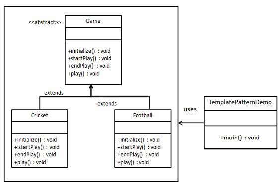

### 模板模式

1. 需要在子类重写的通用方法
2. 优点：
      1) 封装不变部分，扩展可变部分
      2) 提取公共代码，便于维护
      3) 行为由父类控制，子类实现「也就是父类决定它在哪里用吗，子类决定它能干什么」
3. 缺点：
      1) 每一个不同的实现都需要一个子类来实现，到之类的个数增加，系统更加庞大
4. 使用场景：
      1) 有多个子类共有的方法，且逻辑相同
      2) 重要的复杂的方法可以考虑作为模板方法
###  为防止恶意操作，一般模板方法上都加上final关键字 
