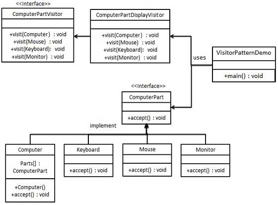

### 访问者模式

1. 主要解决稳定的数据结构和易变的操作耦合的问题
2. 优点：
      1) 符合单一职责原则
      2) 优秀的扩展性、灵活性
3. 缺点：
      1) 具体的元素对访问者公布细节，违反了迪米特法则
      2) 具体元素变更比较困难
      3) 违反了依赖倒置原则，依赖了具体类，没有依赖抽象「示例里的ComputePartDisplayVisitor」
4. 使用场景：
      1) 对象结构中对象对应的类很少改变，但经常需要在此对象结构上定义新的操作
      2) 需要对一个对象结构中的对象进行很多不同的并且不相关的操作，而需要避免让这些操作"污染"这些对象的类，也不希望在增加新的操作时修改这些类
###  访问者可以对功能进行统一，可以做报表、UI、拦截器与过滤器 
